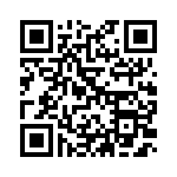

# 📜 Projeto Cordel - Loreine Ewald

Projeto realizado no Curso de <strong>HTML5</strong> e <strong>CSS3</strong> do Curso em Vídeo. 
Com Professor <strong>Gustavo Guanabara</strong>.

Este projeto é uma homenagem à literatura de cordel nordestina, criado como exercício de front-end utilizando **HTML5 e CSS3**, com destaque para o efeito **parallax** e um layout visualmente impactante.

---

## ✍️ Sobre o Projeto

Inspirado no estilo popular da literatura de cordel, este projeto tem como objetivo apresentar uma narrativa poética em uma interface visual atrativa. Utiliza imagens em **parallax scrolling**, que criam um efeito de profundidade à medida que o usuário rola a página.

> O conteúdo textual utilizado é um poema fictício com temática regional, estilizado para se parecer com um folheto tradicional de cordel.

---

## 🌄 Efeito Parallax

A técnica de parallax foi aplicada usando **background-attachment: fixed** e camadas de imagem com diferentes velocidades de rolagem. Isso dá um toque de dinamismo e profundidade ao layout da página.

---

## 📱 Responsividade

A página se ajusta a diferentes tamanhos de tela, sendo compatível com:

- 💻 Desktops
- 📱 Smartphones
- 📟 Tablets

---

## 🔗 Acesse o Projeto

- 🌐 [Visualizar projeto online](https://loreineewald.github.io/projeto-cordel/)
- 📁 [Ver código-fonte no GitHub](https://github.com/loreineewald/projeto-cordel)

--

## 📱 Escaneie com seu celular

  

